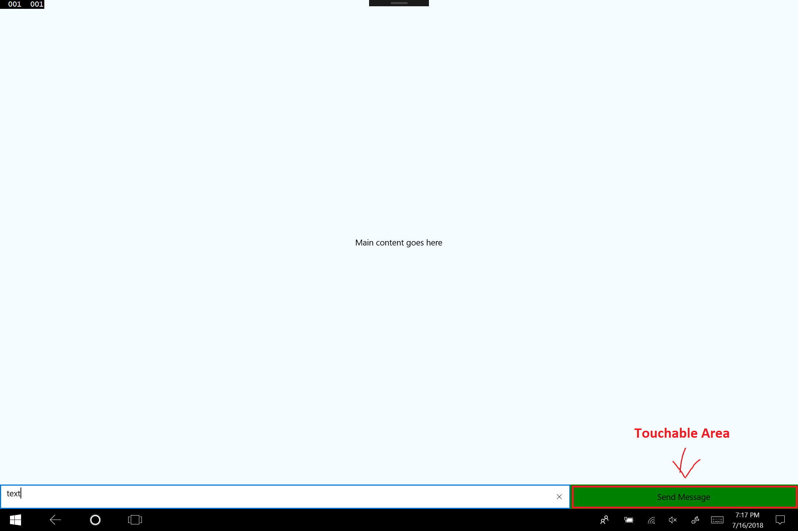
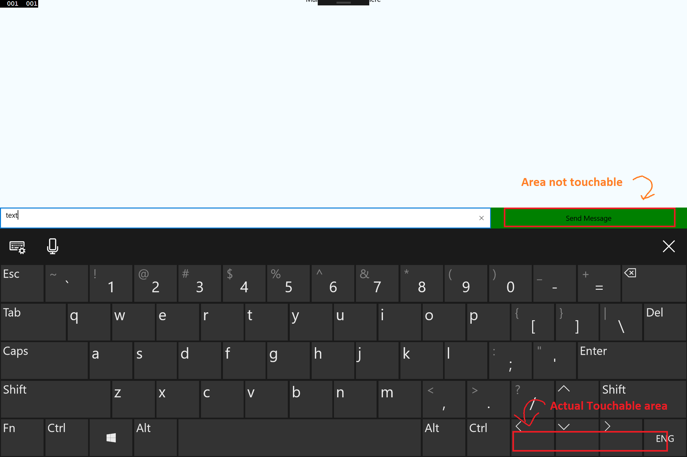

### React Native Windows - Soft Keyboard Issue

This is a sample project to demonstate a bug that exists in [react-native-windows](https://github.com/Microsoft/react-native-windows)

The issue is related to Touchable Area's and Soft Keyboard on Windows.
When there is a Soft Keyboard triggered - the UI is correctly updated and moved to the top (not to cover Text Input) which is fine. But the touchable area's aren't moving with UI and might be covered by keyboard. So it's not possible to press anywhere in the app untill the Soft Keyboard will be hidden.

Example UI before keyboard appears:

Example UI after soft keyboard appears:

